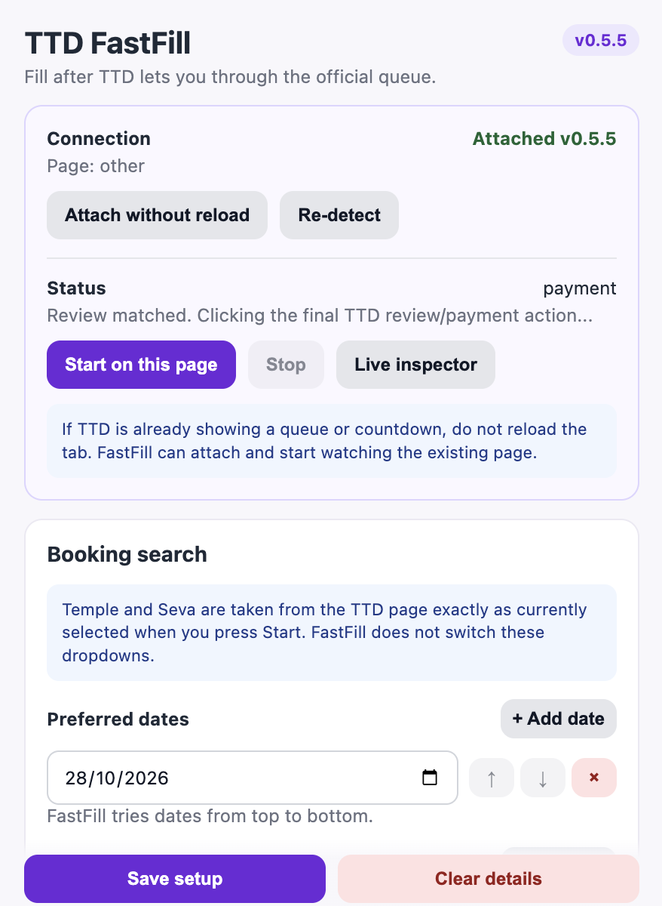
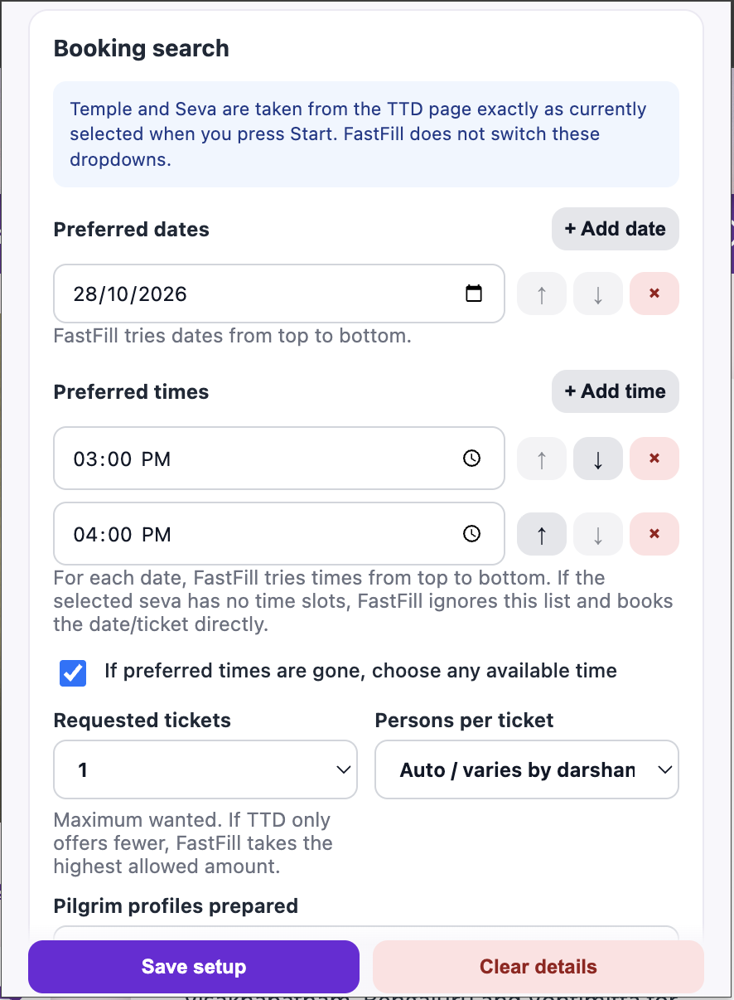
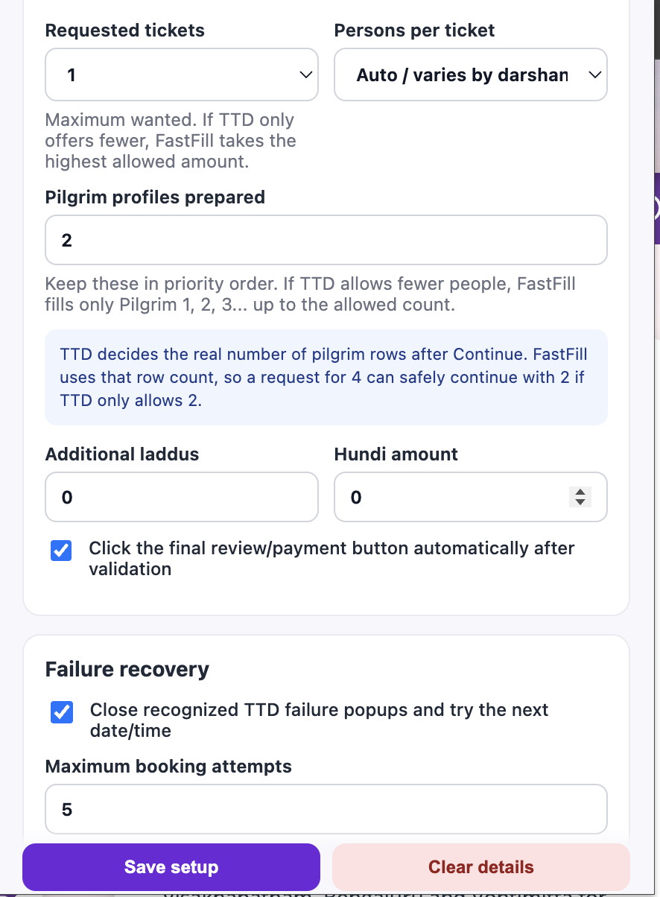
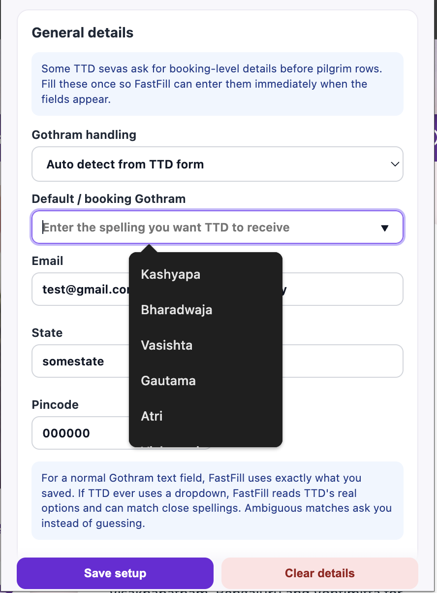
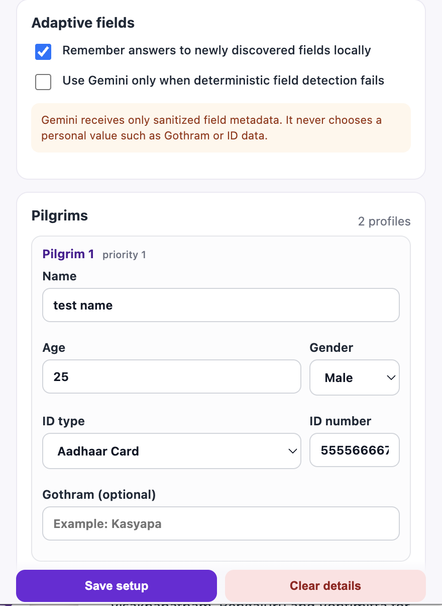
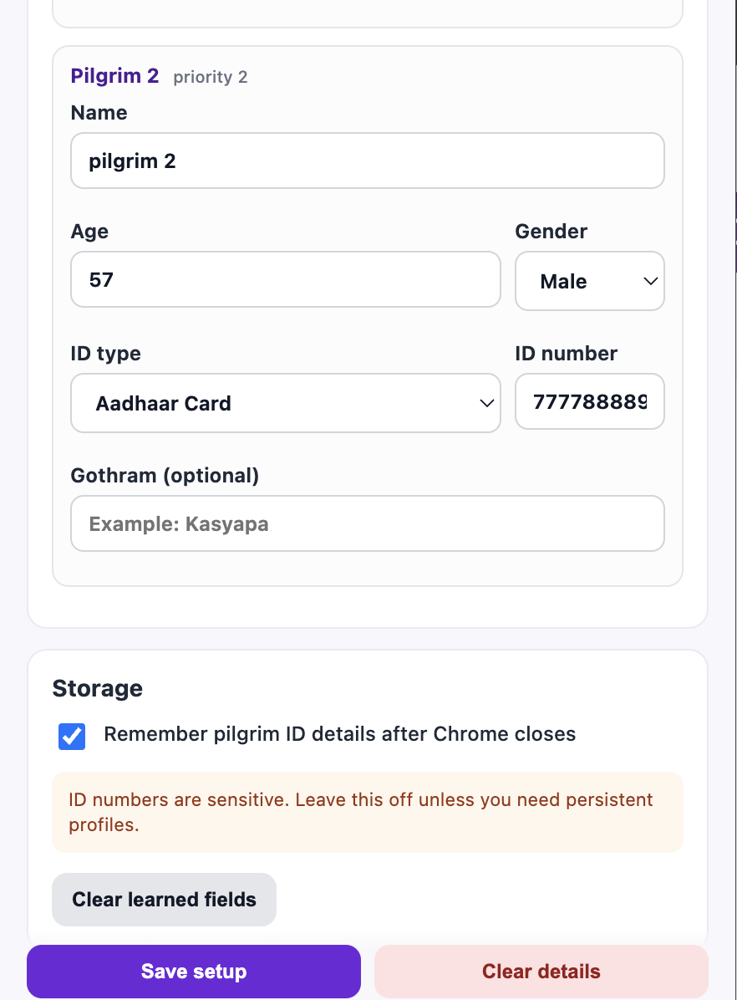

# TTD FastFill v0.5.5

TTD FastFill is a Chrome/Chromium extension that helps users complete booking forms on the official [TTD Online Services website](https://ttdevasthanams.ap.gov.in/home/dashboard) after TTD allows them through its queue.

It prepares booking preferences and pilgrim details in advance, watches the normal TTD booking flow, and fills supported fields when they appear. It is intended to reduce repetitive typing and avoid mistakes during time-sensitive Darshan and Arjitha Seva bookings.

> [!IMPORTANT]
> TTD FastFill is an independent helper and is not affiliated with or endorsed by Tirumala Tirupati Devasthanams. It does not bypass the official queue, login, CAPTCHA, OTP, availability checks, booking limits, payment authentication, or any other TTD control. Availability and a successful booking are never guaranteed.

## Demo

[](docs/assets/ttd-fastfill-demo.mp4)

**[▶ Watch the demo video](docs/assets/ttd-fastfill-demo.mp4)**

## Why we created it

TTD booking sessions can involve a queue followed by several forms that must be completed quickly. Users may need to repeatedly enter dates, times, ticket preferences, contact information, Gothram details, and pilgrim identity information. If a slot disappears, the same process may need to be repeated for another date or time.

FastFill was created to make that process less stressful by:

- keeping preferred dates and times in priority order;
- filling supported booking and pilgrim fields from a saved setup;
- adapting to the different form layouts used by Darshan and Arjitha Seva pages;
- selecting the highest allowed ticket count when TTD offers fewer tickets than requested;
- recovering from recognized availability failures and trying the next configured option; and
- attaching to an already-open TTD tab without forcing a refresh.

FastFill only acts on controls that TTD presents in the user's existing browser session. TTD remains the source of truth for availability, ticket counts, pilgrim rows, booking rules, and payment.

## Main features

- Ordered preferred dates and times
- Optional fallback to any available time
- Timed, date-only, and Seva-card booking layouts
- Ticket-count fallback, including zero-padded values such as `01` and `02`
- Multiple pilgrim profiles in priority order
- General details including Gothram, email, city, state, country, and pincode
- Optional additional laddus and Hundi amount
- Recognized failure-popup recovery with a configurable attempt limit
- Live page inspector and queue/countdown observation
- No-reload attachment for an existing TTD tab
- Local adaptive-field learning and an optional sanitized Gemini fallback

## Install

1. Download and extract the latest release ZIP.
2. Open `chrome://extensions` and enable **Developer mode**.
3. Click **Load unpacked** and select the extracted folder containing `manifest.json`.
4. Confirm that **TTD FastFill v0.5.5** is enabled.

If a TTD page or queue is already open, do **not** refresh it. Open FastFill and select **Attach without reload**.

## How to use

### 1. Open the official TTD website

Visit the [TTD Online Services dashboard](https://ttdevasthanams.ap.gov.in/home/dashboard), sign in normally, complete any CAPTCHA or OTP yourself, and enter the required official queue.

### 2. Configure the booking search

Open the extension and add preferred dates and times in priority order. Choose the maximum number of tickets you want and, when appropriate, allow FastFill to use any available time after the preferred choices are exhausted.

FastFill uses the Temple and Seva already selected on the TTD page. It does not change those selections automatically.

<p align="center">
  
</p>

For a timed service, FastFill tries each configured date/time combination in order. For a date-only Seva, it ignores the preferred-time list and continues with the date and ticket count. On supported Seva-card pages, it selects the first qualifying available card.

### 3. Configure ticket and recovery behavior

The requested ticket count is a maximum. If fewer tickets are available, FastFill uses the highest amount TTD currently allows. The actual pilgrim rows rendered by TTD remain authoritative.

You can also allow FastFill to close recognized availability-error dialogs and try the next date/time, up to the configured maximum number of attempts.

<p align="center">
  
</p>

Keep automatic final review/payment clicking disabled during your first tests. Always review TTD's booking summary before proceeding.

### 4. Add general details

Some Seva forms request booking-level details before the individual pilgrim rows. Save only the information you want FastFill to enter when matching fields appear.

For Gothram text fields, FastFill uses the saved spelling. If TTD presents a dropdown, it can match a clear spelling variation against TTD's current options; ambiguous matches require user confirmation.

<p align="center">
  
</p>

### 5. Add pilgrim profiles

Add the pilgrims in priority order. When TTD renders fewer pilgrim rows than the number of prepared profiles, FastFill fills only the first profiles up to TTD's allowed count. It stops instead of inventing a pilgrim when TTD renders more rows than the saved setup can supply.

<p align="center">
  
  
</p>

### 6. Save and start

1. Select **Save setup**.
2. Return to the appropriate TTD booking page.
3. Open FastFill and select **Start on this page**.
4. Use **Live inspector** if you want to see the detected page state and controls.
5. Verify the final booking summary before continuing to payment.

<p align="center">
  
</p>

## Privacy and storage

Pilgrim details use Chrome session storage by default. They are retained in `chrome.storage.local` only when **Remember pilgrim ID details after Chrome closes** is enabled. ID numbers are sensitive, so persistent storage should be enabled only when needed.

Learned field mappings, adaptive answers, and confirmed Gothram aliases are stored locally and can be removed with **Clear learned fields**. **Clear details** removes the configured booking and pilgrim information.

Gemini fallback is optional and disabled by default. When enabled, it is used only after deterministic and learned field matching fail. It receives sanitized field metadata—not pilgrim names or identity numbers—and never chooses a personal value.

## Safe-use recommendations

- Install only from a release or source that you trust.
- Start with **Click the final review/payment button automatically** turned off.
- Verify the selected date, time, ticket count, service, and pilgrim details on TTD's review page.
- Do not refresh an active TTD queue merely to attach FastFill.
- Do not share screenshots or recordings containing real personal or identity information.
- Stop the extension if the live TTD page no longer matches the expected flow.

## What changed in v0.5.5

- Fixed zero-padded ticket selectors such as `01` and `02`.
- Treated disabled ticket inputs as fixed TTD counts instead of clickable dropdowns.
- Added fallback support for pages that show Seva cards instead of explicit time-slot controls.
- Skipped Seva cards with zero or one available booking and supported trying the next qualifying card after a recognized rejection.
- Added selected-date recognition for headings such as `Select any 1 Seva: Dated 28 Oct,2026`.
- Expanded Live Inspector reporting for Seva-card availability.

See [CHANGELOG.md](CHANGELOG.md) for the complete version history.

## Development and local testing

The repository includes mock TTD pages for queue, slot, pilgrim, review, date-only Seva, and Seva-card flows.

```bash
python3 scripts/manifest_mode.py test
python3 -m http.server 4173 --directory test/mock-ttd
```

Open the required mock page at `http://localhost:4173`, reload the unpacked extension, and test with automatic final payment clicking disabled.

Restore production mode after testing:

```bash
python3 scripts/manifest_mode.py prod
```

## Current limitation

FastFill can select only dates currently rendered in TTD's calendar. It does not automatically move between calendar months.
